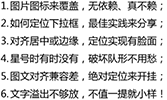
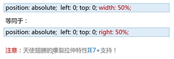
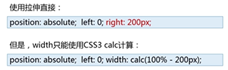
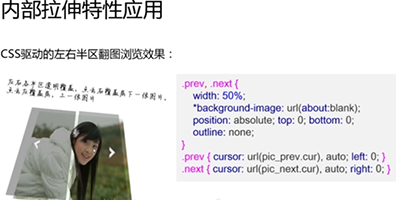
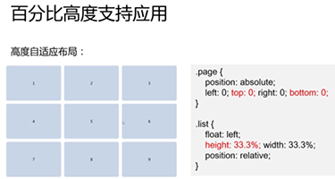

# CSS 深入理解之 absolute
## absolute 与 float　之间的兄弟关系
### 相同的特性表现
* 包裹性
* 破坏性

因为相同的特性表现，所以在页面布局上是可以相互替代的

## absolute 和 relative 的关系
relative 和 absolute 是分离的，对立的

## absolute
### 无依赖的 absolute 定位
不受 relative 限制的 absolute 定位，行为表现上是不使用 top/right/bottom/left 任何一个属性或使用 auto 作为值！  
定位的行为表现：  

* 脱离标准文档流

absolute的特性： 

* 去浮动
* 位置跟随	  

### IE7 永远的 inline-block 水平
IE7 浏览器下任何元素绝对定位后，都会变为 inline-block 属性显示（实际上，display属性值没有改变，只是展示方式都变为 inline-block 属性值的样式显示）  
解决： 套一个空的 div 

### 配合 margin 精确定位
* 支持负值定位
* 超赞的兼容性 - IE 6

### 总结
使用无依赖的 absolute 定位（利用其位置跟随特性，配合 margin 值），不影响其他布局，可实现良好的定位　　   
用老师的话说： 把这种无依赖的 absolute 定位称之为不影响其他布局的绝对定位下的相对定位之王。  
优点：　　　

* 父级元素不需要使用 relative（减少多余的 relative，最小化影响）
* 自适应性（无依赖的绝对定位本质上相当于相对定位） 

## 无依赖的 absolute 相对定位实例篇

### 图片图标绝对定位覆盖
使用无依赖的 absolute　定位利用其位置跟随特性，配合 margin　值，实现。
### 使用无依赖的 absolute 实现自定义下拉框的定位效果
同样的也是使用无依赖的 absolute 定位利用其跟随特性，配合 margin　值，实现。
### 如何使用 text-align 属性，控制无依赖 absolute 元素的居中或边缘定位效果

### 总结
无依赖绝对定位为页面布局与重构提供了更加广阔的选型新思路

## absolute 和层级
### absolute 定位元素脱离文档流
#### 回流与重绘
动画尽量作用在决定定位元素上！

### 垂直空间和层级
多个绝对定位元素，垂直空间层级遵循后来居上原则（DOM 顺序）

### z-index 误区
误区： 绝对定位元素都需要 z-index 控制层级，确定其显示的垂直位置。

### z-index 无依赖
* 如果只有一个绝对定位元素，自然不需要 z-index,自动覆盖普通元素
* 如果两个绝对定位元素，控制 DOM 流的前后顺序达到需要覆盖效果，依然无 z-index;
* 如果多个绝对定位交错，非常非常少见， z-index: 1 控制；
* 如果非弹框类的绝对定位元素 z-index > 2, 必定 z-index 冗余，请优化！

## absolute 定位元素下 top/bottom/left/right
通过设置 top/bottom left/right 可使绝对定位元素在已定位祖先元素容器（position: relative/absolute/fixed/sticky）内偏移！  
如果没有已定位祖先元素： 以 HTML 根元素为参照基准偏移

## absolute 和 width/height
### left/top/right/bottom 与 width/height 之间异曲同工与特殊表现
#### 相互替代性
很多情况下 absolute 的高宽拉伸效果和 width/height 是可以互相替代的

#### 差异所在-拉伸更强大
实现一个距离右侧200像素的全屏自适应的容器层，你会怎么实现？

#### 相互支持性
* 容器不需要固定 width/height 值，内部元素亦可拉伸  
  
* 容器拉伸，内部元素支持百分比 width/height 值
  

#### 相互合作性
如果拉伸和 width/height 尺寸同时存在，会怎么样呢？  
width/height 设置的尺寸 **大于** left/top/right/bottom 拉伸的尺寸（也就是说同时设置两者的值时，width/height 起作用）
  
当遭遇 margin: auto 的时候，两者的合作性就体现出来了！  
当尺寸限制、拉伸以及 margin: auto 同时出现的时候，就会有绝对定位元素的绝对居中效果！  
注意： 这种绝对居中的效果特性在 IE8+ 浏览器才能支持

## absolute 网页整体布局
适合移动 web 的布局策略
### 摆脱狭隘的定位
与fixed, relative一样，absolute设计的初衷确实是定位(position)，
但与fixed, relative不同的是，absolute包含更多特有且强大的特性，
如果仅仅是使用其实现一些覆盖与定位，则未免大材小用了，
不妨发挥其潜力，试试使用absolute实现网页的整体布局，
你会发现：兼容性好，自适应强，扩展方便，性能优异，可以方便实现诸多效果，适合移动端，PC端同样精彩。

### absolute 与整体布局
#### body 降级，子元素升级
升级的子div(假设类名为page)满屏走起：  

	.page { position: absolute; left: 0; top: 0; right: 0; bottom: 0 }

绝对定位受限于父级，因此，page要想愉快地拉伸，需要：

	html, body { height: 100%; }

#### 各模块-头尾、侧边栏(PC端)各居其位
	header, footer { position: absolute; left: 0; right: 0; }
	header { height: 48px; top: 0; }
	footer { height:  52px; bottom: 0; }
	aside { 
	    width: 250px;
	    position: absolute; left: 0; top: 0; bottom: 0 
	}

#### 内容区域想象成body
	. content { 
	    position: absolute;
	    top: 48px; bottom: 52px; 
	    left: 250px(如果侧边栏有);
	    overflow: auto;
	}
此时的头部尾部以及侧边栏都是fixed效果，不跟随滚动。避免了移动端position: fixed实现的诸多问题。

#### 全屏覆盖与page平级
	. overlay { 
	    position: absolute;
	    top: 0; right: 0; bottom: 0; left: 0;
	    background-color: rgba(0,0,0,.5);
	    z-index: 9;
	}
	

	

