## border-width 不支持百分比
### 为什么 border-width 不支持百分比？

* 语义和使用场景决定的（不会因为设备大就按比例大的）

类似的还有 outline,box-shadow,text-shadow

### border-width 还支持关键字
* thin: 薄薄的 1px
*　medium(默认值)：　薄厚均匀　３px
* thick: 厚厚的 5px

IE 7 除外（不支持）

## 深入了解各种 border-style 类型
### border-style: solid
### border-style: dashed
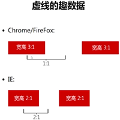
### border-style: dotted
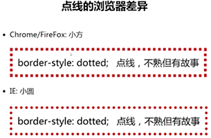	  
可以实现 IE7/8 下的圆角效果	
### border-style: double 
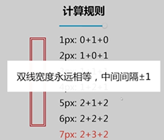	      
兼容性非常的好，可以用来绘制图形  
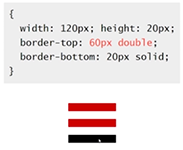	  
### border-style: inset (内凹，风格过时+兼容性差)
### border-style: groove (沟槽，风格过时+兼容性差)
### border-style: ridge (山脊，风格过时+兼容性差)

## border 与 color
### border-color 默认颜色就是 color
当没有指定 border-color 的时候，会使用 color 作为边框色！
类似使用默认颜色作为颜色的属性值还有： box-shadow,text-shadow 等  

### 有什么用？  
只需要一个 color hover 变化，就可以一起变色，而传统的实现方法需要三个 hover；且 transition 过渡也只要一个 color 属性。 
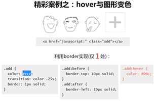  

## border 与 background 定位
### background 定位的局限
只能相对左上角数值定位，不能相对于右下

#### 借助 border 实现图片固定右下角的定位效果
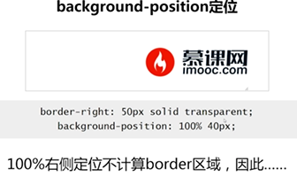 

## border 与三角形等图形构建 
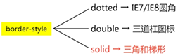   
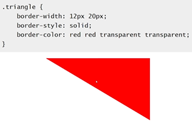   

### border 实现三角的原理是什么？
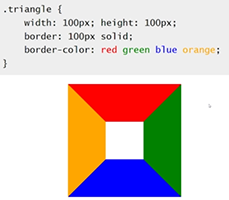 

### 实际应用场景
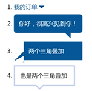 

### 更高级的应用： 模拟圆角
在不使用 css3 属性 border-radius 的情况下（优点： 兼容性好，兼容 ie6/7）  
 

### 原理
由上下两个梯形（border）和内容去组成
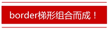 

## border 与透明边框
border 的透明边框用途非常广！因为，始于 IE7，足够兼容

### 案例
 
  

### 优雅增加响应区域大小-复选框
不适用图片如何实现下面的单复选框  
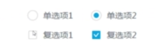   

实现复选框，且增加响应区域大小
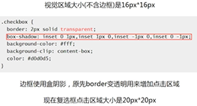 

### 增加可视渲染区域
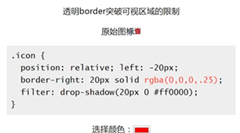 

## border 在布局中的应用
### 有限标签下的标题栏
### border 与等高布局
原理： 
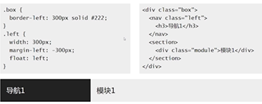   
局限： 不支持百分比分宽度！