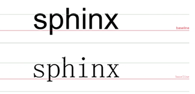

## line-height 的定义
line-height: 行高，两行文字基线之间的距离

### 基线？
  

### 为什么是基线？
基线是 * 线（上边缘线、下边缘线...）定义的根本！
### 需要两行？
两行的定义已经决定了一行的表现

### baseline 与 line-height
两行基线之间的距离就是我们的行高   

### baseline 与字体: Arial（上）Simsun(下)
不同的字体，基线的位置是不一样的   

### 为什么 line-height 可以让单行文本垂直居中？ 	
line-height 设置的同时，如果设置了 font-size值为 0px 才能真正的做到单行文本垂直居中

## line-height 与行内框盒子模型
行内框盒子模型-CSS 进阶必备知识
### 行内框盒子模型
	
这是一行普通的文字这里有个<em>em</em>标签。
 
上面这段代码有四种类型的盒子： 

* 内容区域：是一种围绕文字看不见的盒子。内容区域的大小与 font-size 大小相关
* 内联盒子：内联盒子不会让内容成块显示，而是排成一行。
* 行框盒子：每一行就是一个行框盒子，每个行框盒子又是由一个一个内联盒子组成
* 包含盒子： p 标签所在的包含盒子，此盒子由一行一行的 行框盒子 组成

## line-height 的高度机制
深入理解内联元素的高度表现
### 文本占据的高度
内联元素的高度是由 line-height 决定的！

### line-height 明明是两基线距离，单行文字哪来行高，还控制了高度
* 行高由于其继承性，影响无处不在，即使单行文本也不例外
* 行高只是幕后黑手，高度的表现不是行高，而是内容区域和行间距
* 只不过： 
> 内容区域高度 + 行间距  =  行高 

内容区域高度只与字号（font-size）以及字体(font-family)有关,与line-height 没有任何关系。在 **simsun （宋体）** 字体下，**内容区域高度等于文字大小值**。 （其他的字体可能不等）  
simsun 字体下：  font-size + 行间距 = line-height  

总结： 行高决定内联盒子高度；行间距可大可小（甚至负值），保证高度正好等同于行高

### 如果行框盒子里面有多个不同行高的内联盒子？高度怎么表现？

### 若行框盒子里面混入 inline-block 水平元素（如图片），高度如何表现呢？

## line-height 各类属性值
line-height 支持下面几种类型的值： 

* normal
* < number>
* < length>
* < percent>
* inherit

### normal
默认属性值。跟着用户的浏览器走，且与元素字体关联
### < number>
使用数值作为行高值。例如：

	line-height: 1.5;

根据当前元素的 font-size 大小计算 
### < length>
使用具体长度值作为行高值。例如

	line-height: 1.5em；
	line-height: 1.5rem;
	line-height: 20px;
	line-height: 20px;
### < percent>
使用百分比值作为高度值。例如： 

	line-height: 150%

相对于设置了该 line-height 属性的元素的 font-size 大小计算
### inherit
行高继承。 IE8+

	input: { line-height: inherit }
input 框等元素默认行高是 normal,使用 inherit 可以让文本框样式可控性更强

### < number> < length> < percent>  有什么区别？
计算上无差别，但是应用于元素有差别

* line-height: 1.5 所有可继承元素根据 font-size 重计算行高
* line-height: 150%/1.5em 当前元素根据 font-size 计算行高，继承给下面的元素；

### body 全局数值行高使用经验
博客类行高类设置： 1.5/1.6  
面向用户的网页开发： 匹配 20 像素的使用经验(line-height: 20px/14px = 1.42857,设置为 1.4286 即可) 

## line-height 与图片的表现
### 行高会不会影响图片实际占据的高度？
行高不会影响图片实际占据的高度！
### 行高与图文混排
图片底部会与文字基线（默认baseline英文字母底部）对齐！调整行高就相当于调整文字高度，因为要图片与文字基线对齐所以看似图片占据的高度变高了，实际上没有！
### 消除图片底部间隙（因为设置行高出现的）的方法
* 图片块状化 - 无基线对齐
		
		img { display: block}

* 图片底线对齐

		img { vertical-align: bottom}

* 行高足够小 - 基线上移

		.box { line-height: 0;}

## line-height 的实际应用
### 图片的水平垂直居中
	.box { line-height: 300px; text-align: center;}
	.box > img{ vertical-align: middle
	(基线往上 1/2 * 高度；所以如果基线如果下沉那么并不是绝对的居中);}
### 多行文本垂直水平居中
	.box { line-height: 250px; text-align: center;}
	.box > .text{ display: inline-block; line-height: normal;
	text-align: left;vertical-align:middle;}

	