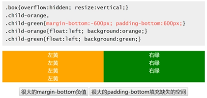

## CSS margin 与容器的尺寸
css margin可以改变容器的尺寸
### margin 与可视尺寸（clientWidth: 包含border）

* 适用于没有设定 width / height 的普通 block 水平元素
* 只适用于水平方向尺寸

### 利用这一特性？

* 一侧定宽的自适应布局
* 两端对齐的布局效果

### margin 与占据尺寸（outerWidth： 包含margin）

* block / inline-block 水平元素均适用
* 与有没有设定 width / height 值无关
* 适用于水平方向和垂直方向

### 利用这一特性？

* 滚动容器上下留白
* 多栏或两栏的等高布局

## CSS margin 与百分比单位

* 水平方向百分比 / 垂直方向百分比
* 普通元素百分比 / 绝对定位元素百分比

### 百分比 margin 的计算规则
普通元素的百分比 margin 都是相对于容器的宽度计算的

### 绝对定位元素的百分比 margin 
绝对定位元素的百分比 margin 是相对于第一个具有定位祖先元素（relative/absoulte/fixed）的宽度来计算的

###　如何利用这一特性？
宽高 2:1 自适应矩形

## 正确看待 CSS 的 margin 重叠
### margin 重叠通常特性

* block 水平元素 （不包括 float 和 absolute 元素）
* 不考虑 writing-mode, 只发生在垂直方向（margin-top/margin-bottom）

### margin 重叠3种情形

* 相邻的兄弟元素
* 父级和第一个/最后一个子元素

* 空的 block 元素  

### margin 重叠的计算规则

* 正正取大值
* 正负值相加
* 负负最负值

### margin 重叠的意义？

* 连续段落或列表之类，如果没有margin 重叠，首尾项间距会和其他兄弟标签 1:2 关系，排版不自然。
* 网页中在任何地方嵌套或插入一个裸的 div 都是不会影响原来的布局。
* 遗落的空任意多个 
 元素，不要影响原来的阅读排版。

总结： 就是为了让传统的网页（以浏览获得信息为主的早前网页）浏览起来更舒服

### 善用 margin 重叠
善用 margin 健壮性更好（例如： 表单列表，最后一个元素移除后，提交按钮和最后一个按钮之间仍然有底部补白）

## 理解 CSS 中的 margin: auto
### margin: auto 的作用机制
元素有时候，就算没有设置 width 或 height,也会自动填充对应的方位；

### 你需要知道的一些事实！

* 元素有时候，就算没有设置 width 或 height，也会自动填充；
* 如果设置 width 或 height， 自动填充特性会被覆盖（原本应该填充的尺寸被 width / height　强制变更，而　margin: auto 就是为了填充这个变更的尺寸设计的）
* 如果一侧定值，一侧 auto， auto 为剩余空间大小，如果两侧均是 auto，则评分剩余空间（前提条件是子元素自动填充父容器宽度所以才能使用auto居中）

### 图片为什么不居中
时 inline 元素，如果没有设置宽度值，其不能占据整个容器空间宽度，auto 并不能分配剩余空间也就是不能居中；解决办法设置图片展示方法为 display: block

### 为什么明明容器定高，元素定高，margin：auto 0还是不能垂直居中？

* 高度并不会自动填充高度（页面元素流默认为水平流，并不是纵向流）
* margin 计算出负值时并不能居中

### writing-mode 与垂直居中
设置 writing-mode: vertical-lr; (设置流为纵向流，垂直方向)

### 绝对定位元素的 maring: auto 居中
absolute 与 margin 居中  
  

## CSS margin 负值定位
### margin 负值下的两端对齐
margin 改变元素尺寸  

### margin 负值下的等高布局
margin 改变元素占据空间  

### margin 负值下的两栏自适应布局
元素占据空间跟随 margin 移动  

## CSS margin 无效情形解析
### inline 水平元素的垂直 margin 无效
两个前提： 

* 非替换元素，例如，不是  元素
* 正常书写模式

### margin 重叠
### display: table-cell 与 margin 
### position: absolute 与 margin 

* 绝对定位元素非定位方向的 margin 值“无效”（绝对定位的 margin 值一直有效，只是不像普通元素！因为它脱离了标准文档流，所以margin值表现看不出）

### 鞭长莫及导致的 margin 值无效 
这看上去无效，实际上是因为值不够大而已

### 内联特性导致的 margin 值无效 

## CSS margin-start and margin-end
### margin-start

* 正常的流向，margin-start 等同于 margin-left, 两者重叠不累加
* 如果水平流是从右往左，margin-start 等同于 margin-right
* 在垂直流下（writing-mode: vertical-*;）,margin-start 等同于 margin-top

