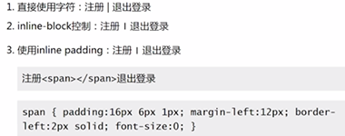
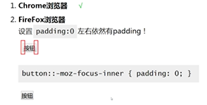
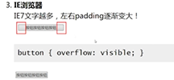
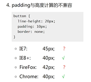
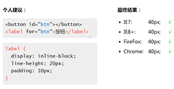
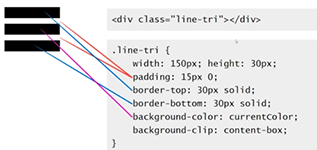
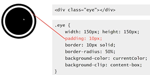

## CSS padding 与容器的尺寸关系复杂
### 对于 block 水平元素

* padding 值暴走，一定会影响尺寸
* width 非 auto,padding 影响尺寸
* width 为 auto 或 box-sizing 为 border-box,同时 padding 值没有暴走，不影响尺寸。 

注意： border-box 属性值

### 对于 inline 水平元素
水平 padding 影响尺寸，垂直 padding 不影响尺寸，但是会影响背景色（占据空间）

### 如何利用这一特性？
高度可控的分割线  

## CSS padding 负值和百分比值
### padding 不支持任何负值
### padding 百分比均是相对于宽度计算的

### 如何利用这一特性？

* 轻松实现一个正方形

### inline 水平元素的 padding  百分比值

* 同样相对于宽度计算
* 默认的高度宽度细节有差异
* padding 会断行

### 空 inline 元素 + padding 高宽也不等
inline 元素的垂直 padding 会让 "幽灵空白节点" 出现，也就是规范中的 "strut" 出现（设置 font-size：0；即可使高宽一致；
幽灵空白节点本质上是一个内联元素文本，所以受 font-size 的影响）

## 标签元素的内置 padding 
### ul/ol 列表
ol / li 元素内置 padding-left, 但是单位是 px 不是 em

### 表单元素的内置 padding

* 所有浏览器 input / textarea 输入框内置 padding 
* 所有浏览器 button 按钮内置 padding
* 部分浏览器 select 下拉内置padding, 如 Firxfox IE8+ 可以设置padding
* 所有浏览器 radio / checkbox 单复选框无内置 padding
* button 按钮元素的 padding 最难控制
button 表单 按钮 padding  
  
  
  
  

## padding 与图形绘制
### 实现大队长的三道杠，借助 padding 实现
  

### 借助 padding 实现白眼效果
  

## padding 布局实践
### 使用百分比单位构建固定比例布局结构
### 配合 margin 等高布局
### 两栏自适应布局

