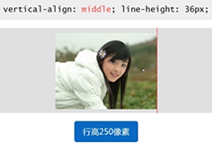
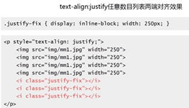
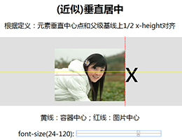
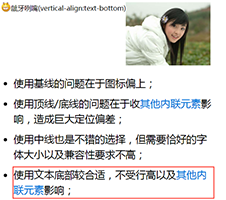
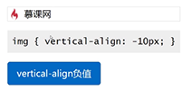
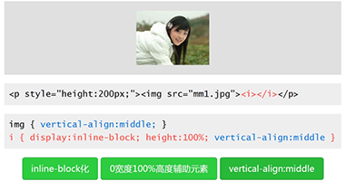
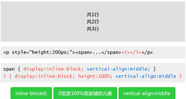

## vertical-align 家族的基本认识
了解 vertical-align 支持的属性值以及组成
### inherit
### 线类
baseline（默认值），top，middle，bottom
### 文本类
text-top, text-bottom
### 上标下标类
sub, super
### 数值百分比类
10px,2em,20%,....  
注： vertical-align 的百分比值是相对于 line-height 计算的！（IE6/IE7 浏览器下， vertical-align 百分比值不支持小数 line-height）

总的来说 vertical-align 的属性值有两大类，数值类和百分比类，它们具有以下共性：

* 都带数字
* 都支持负值
* 行为表现一致

## vertical-align 起作用的前提
探讨各种 display 值对 vertical-align 的影响！  
vertical-align **起作用是有前提条件**的: 应用于 inline 水平以及 'table-cell' 元素,也就是说默认状态下： 图片、按钮、文字和单元格

* inline水平

		inline: ,,<strong>,<em>,未知元素，...
		inline-block: <input>(IE8+),<button>(IE8+),...

* table-cell 元素

		tabel-cell: <td>

### 可显示的和间接的更改元素的 inline水平
* display: 更改元素的显示水平；直接 display 属性设置
* CSS 声明间接更改元素的显示水平

## vertical-align 与 line-height 之间的关系
vertical-align 百分比是相对于 line-height 值计算的  
对于内联元素，vertical-align 与 line-height 虽然看不见，但实际上 '到处都是'！

### 基本现象衍生： （近似）垂直居中
     
该种做法支持 IE7+ 浏览器以上，其他的浏览器兼容性良好

### 通过简单现象看复杂现象

### CSS2 的可视化格式模型文档
inline-block 的基线是正常流中最后一个 line box 的基线，除非，这个 line box 里面既没有 line-boxes 或者本身 overflow 属性的计算值而不是 visible, 这种情况下基线是 margin 底边缘

## vertical-align 线类属性值深入理解
深入理解 vertical-align 底线、顶线、中线的行为表现。
### vertical-align:bottom
* inline/inline-block元素： 元素底部和整行的底部对齐。
* table-cell元素： 单元格底padding边缘和表格行的底部对齐
### vertical-align:top
* inline/inline-block元素： 元素顶部和整行的顶部对齐。
* table-cell元素： 单元格顶padding边缘和表格行的顶部对齐。
### vertical-align:middle
* inline/inline-block元素： 元素的垂直中心点和父元素基线上1/2 x-height处对齐。
* table-cell元素： 单元格填充盒子相对于外面的表格行居中对齐。  
文本不同系列字体间的内容高度中心是不同的，之间会有下沉的！(解决的办法设置： font-size:0,使字体的中线、底线、基线都在一条线上)  

## vertical-align 文本类属性值深入理解
* vertical-align:text-top (盒子的顶部和父级content area的顶部对齐。)
* vertical-align:text-bottom (盒子的低部和父级content area的低部对齐。)

注意： 

* 元素vertical-align垂直对齐的位置与前后的元素都没有关系；
* 元素vertical-align垂直对齐的位置与行高line-height没有关系，至于字体大小font-size有关；

### 实际作用
表情图片（或原始尺寸背景图标）与文字的对齐效果  

## vertical-align 上标下标类属性值深入理解
vertical-align:sub/super
### HTML 中的上标和下标
* HTML中的上标：
* HTML中的下标：

注意： HTML 中的上标和下标的表现可以对比为 vertical-align 的属性值

*  → vertical-align:super （提高盒子的基线到父级合适的上标基线位置。）
*  → vertical-align:sub （降低盒子的基线到到父级合适的下标基线位置）

## vertical-align 前后不一的作用机制
相邻元素不同 vertical-align 的行为表现
### 对立属性值
* top/bottom
* text-top/bottom

总结： 关注当前元素和父级，前后并没有直接影响

## vertical-align 的实际应用
### 小图标和文字的对齐

### 不定尺寸图片或多行文字的垂直居中
不定尺寸图片或多行文字的垂直居中主要分为三步： 

* 主体元素 inline-block 化
* 0 宽度 100% 高度辅助元素
* vertical-align: middle

  
  