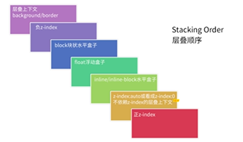

## CSS z-index 基础
### 含义
z-index 属性指定了元素及其子元素的 [z 顺序]，[z 顺序] 可以决定当元素发生覆盖的时候，哪个元素在上面。通常一个较大 z-index 值的元素会覆盖较低的那一个

### 属性值

	* z-index: auto; 默认值
	* z-index: <integer>; 整数值
	* z-index: inherit; 继承

### 基本特性

	* 支持负值
	* 支持 CSS3 animation 动画
	* 在 CSS 2.1 时代，需要和定位元素配合使用

注意： 如果不考虑 CSS3 , 只有定位元素 (position： relative/absolute/fixed/sticky) 的 z-index 才有作用！在 CSS3 中有例外...

## z-index 与 CSS 定位属性
z-index 只对定位元素有作用

### 如果定位元素 z-index 没有发生嵌套
* 后来居上的准则（如果都有定位，在 DOM 中的先后顺序决定）
* 哪个大，哪个上

### 如果定位元素 z-index 发生嵌套
* 祖先优先原则（前提： z-index 值是数值，非 auto!）

## 理解 CSS 中的层叠上下文和层叠水平
元素层叠表现基础且重要的概念

### 层叠上下文
层叠上下文是 HTML 元素中的一个三维概念，表示元素再 z 轴上有了 “可以高人一等”

* 页面根元素天生具有层叠上下文，称之为 "根层叠上下文"
* z-index 值为数值的定位元素也具有层叠上下文
* 其他属性...

### 层叠水平
层叠上下文中的每个元素都有一个层叠水平，决定了同一个层叠上下文中元素在 z 轴上的显示顺序。遵循 “后来居上” 和 "谁大谁上" 的层叠准则。  
层叠水平和 z-index 不是一个东西。普通元素也有层叠水平

层叠上下文的几个特性

* 层叠上下文可以嵌套，组合成一个分层次的层叠上下文
* 每个层叠上下文和兄弟元素独立： 当进行层叠变化或渲染的时候，只需要考虑后代元素
* 每个层叠上下文是自成体系的： 当元素的内容被层叠后，整个元素被认为是在父层的层叠顺序中。

## 理解元素的层叠顺序
### 层叠顺序
元素发生层叠时候有着特定的垂直显示顺序。

### 著名的 7 阶层叠水平

### 层叠顺序的意义
规范元素重叠时候的呈现规则

### 为什么层叠顺序是这样的？
更符合页面加载的功能和视觉呈现

## z-index 与层叠上下文
* 定位元素默认 z-index: auto 可以看成是 z-index: 0;
* z-index 不为auto 的定位元素会创建层叠上下文
* z-index 层叠顺序的比较止步于父级层叠上下文

### 为什么定位元素会覆盖普通元素？
设置定位后 z-index： auto 相当于 z-index: 0; 此时会覆盖内联元素（在层叠顺序中比较高）

### z-index 与创建层叠上下文
从层叠顺序上讲， z-index : auto 可以看成 z-index: 0, 但是从层叠上下文来讲，两者却有着本质的差异：  

* z-index: auto, 不会创建层叠上下文（IE7 bug： 为 auto 时也会创建层叠上下文）  
* z-index: 0, 会创建层叠上下文

### z-index 受限于层叠上下文

## 其他 CSS 属性与层叠上下文
不只是 z-index，以下这些属性都会创建层叠上下文

## z-index 与其他 CSS 属性层叠上下文
非定位元素层叠上下文和 z-index 关系大揭秘
不支持 z-index 的层叠上下文元素的层叠顺序均是 z-index: auto 级别

### 更完整的 7 阶层叠水平

### 依赖 z-index 的层叠上下文元素的层叠顺序取决于 z-index 值
依赖 z-index 值创建层叠上下文的情况：

* position 值为 relative/ absolute 或 fixed(部分浏览器)
* display: flex | inline-flex 容器的子 flex 项

### 层叠上下文导致的有趣现象

## z-index 相关实践分享
### 最小化影响原则
目的： 避免 z-index 嵌套层叠关系混乱  
原因：   

* 元素的层叠水平主要由所在的层叠上下文决定
* IE7 z-index: auto； 也会创建层叠上下文

做法：   

* 避免使用定位属性
* 定位属性从大容器平级分离为私有小容器

### 不犯二准则
目的： 避免 z-index 混乱，一山比一山高的样式问题  
原因： 多人协作以及后期维护  
做法： 对于非浮层元素，避免设置 z-index 值， z-index 值没有任何道理需要超过2——不犯二准则   

### 组件层级计数器
目的： 避免浮层组件因 z-index 被覆盖的问题  
原因：   

* 总会遇到意想不到的高层级元素
* 组件的覆盖规则具有动态性

做法：组件层级计数器方法（通过 JS 获得 body 下子元素的最大 z-index 值）  

### 负值 z-index 与可访问性隐藏
可访问性隐藏： 人肉眼不可见，但是辅助设备可以识别  
z-index 负值元素在层叠上下文的背景之上，其他元素之下。

