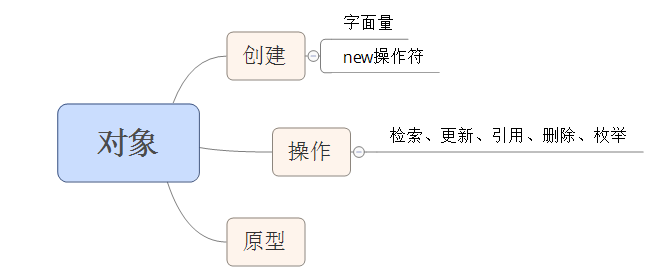

# 第三章 对象
Javascript 的简单数据类型包括数字、字符串、布尔值、null 值和 undefined 值，其他所有的值都是对象。数字、字符串和布尔值"貌似"对象，因为它们拥有方法，但它们是不可变的。   
Javascript 中的对象是可变的键控集合。在 Javascript中，数组是对象，函数时对象，正则表达式是对象。  
Javascript 里的对象是无类型的。它对新属性的名字和属性的值没有限制。  
Javascript 包含一种原型链的特性，允许对象继承另一个对象的属性。正确地使用它能减少对象初始化时消耗的时间和内存。

## 对象字面量
对象字面量提供了一种非常方便地创建新对象值得表示法。一个对象字面量就是包围在一对花括号中的零或多个 "名/值"对。  
属性名可以是包括空字符串在内的任何字符串。在对象字面量中，如果属性名是一个合法的 Javascript 标识符且不是保留字，则并不强制要求用引号括住属性名。所以用引号括住 "first-name" 是必须的，但是否括住 first_name 则是可选的。逗号用来分隔多个 "名/值" 对。

## 检索
要检索对象里包含的值，可以采用在 [] 后缀中括住一个字符串表达式的方式。如果字符串表达式是一个字符串字面量，而且它是一个合法的 Javascript 标识符且不是保留字，那么也可以用 . 表示法代替。优先考虑使用 . 表示法，因为它更紧凑且可读性更好。  
|| 运算符可以用来填充默认值。  
&& 运算符可以用来避免从 undefined 的成员属性中年取值导致的 TypeError 异常

## 更新
对象里的值可以通过赋值语句来更新。如果属性名已经存在于对象里，那么这个属性的值就会被替换。如果没有拥有那个属性名，那么该属性就被扩充到对象中。

## 引用
对象通过引用来传递。它们永远不会被复制。

## 原型
每个对象都连接到一个原型对象，并且它可以从中继承属性。所有通过对象字面量创建的对象都能连接到 Object.prototype,它是 Javascript 中的标配对象。  
当你创建一个新对象时，你可以选择某个对象作为它的原型。 Javascript 提供的实现机制杂乱而复杂，但可以被简化，例如：

	if(typeof Object.geget !== 'function') {
		Object.create = function (o){
			var F = function () {};
			F.prototype = o;
			return new F();
		};
	}
	var another_stooge = Object.create(stooge);

### 注意
* 原型链接在更新时是不起作用的。当我们对某个对象做出改变时，不会触及该对象的原型
* 原型链接只有在检索值得时候才被用到。查找对象的属性值时，先找对象中，对象中没有再往上找，直到终点： Object.prototype。如果想要的属性不存在原型链中，那么结果就是 undefined 值。这个过程称为委托。
* 原型关系是一种动态的关系。如果我么添加一个新的属性到原型中，该属性会立即对所有基于该原型创建的对象可见。

## 反射
检查对象并确定对象有什么属性是很容易的事情，只要试着去检索该属性并验证取得的值。 typeof 操作符对确定属性的类型很有帮助。  
原型链中的任何属性都会产生值：
		
	typeof flight.toString // 'function'
	typeof flight.constructor // 'function'
有两种方法去处理掉这些不需要的属性：

* 检测并丢弃值为函数的属性（一般来说当对象在运行时动态获取自身信息时，你关注更多的是数据，而你应该意思到一些值可能会是函数）
* hasOwnProperty 方法，如果对象拥有独有的属性，它将返回 true。 hasOwnProperty 方法不会检查原型链。

## 枚举
for in 语句可用来遍历一个对象中的所有属性名。枚举过程将会列出所有的属性——包括函数和和你可能不关心的原型中的属性——所以有必要过滤掉那些你不想要的值。最为常用的过滤器是 hasOwnProperty 方法，以及使用 typeof 来排除函数。 

##　删除
delete 运算符可以用来删除对象的属性。它不会触及原型链中的任何对象。

## 减少全局变量污染
全局变量削弱了程序的灵活性，应当避免使用。  
减少全局变量污染的两种方法：

* 最小化使用全局变量的方法之一是为你的应用只创建一个唯一的全局变量（只要把全局性的资源都纳入一个名称空间之下，你的程序与其他应用程序、组件或类库之间发生冲突的可能性就会显著降低。程序也会变得容易阅读）
* 使用闭包来进行信息隐藏的方式，它也可以有效减少全局变量污染。

## 总结
