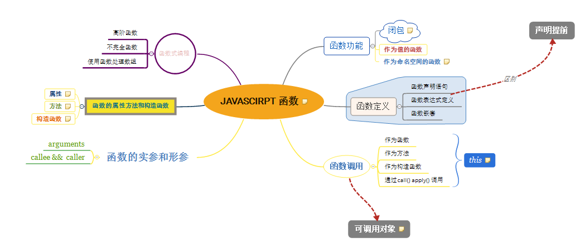

# 第四章 函数
函数包括一组语句，它们是 Javascript 的基础模块单元，用于代码复用、信息隐藏和组合调用。函数用于指定对象的行为。
> 一般来说，所谓编程，就是将一组需求分解成一组函数与数据结构的技能

## 函数对象
Javascript 中的函数就是对象。对象是 "名/值" 对的集合并拥有一个连到原型对象的隐藏连接。对象字面量产生的对象连接到 Object.prototype。函数对象连接到 Function.prototype(该原型对象本身连接到 Object.prototype)。每个函数在创建时会附加两个隐藏属性： 

* 函数的上下文
* 实现函数行为的代码

## 函数字面量
函数对象通过函数字面量来创建；  
一个内部函数除了可以访问自己的参数和变量，同时它也能自由访问把它嵌套在其中的父函数的参数与变量。通过函数字面量创建的函数对象包含了一个连到外部上下文的连接。这被称为闭包，它是 Javascript 的强大表现力的来源。

## 调用
调用一个函数会暂停当前函数的执行，传递控制权和参数给新函数。除了声明时定义的形式参数，每个函数还接受两个附加的参数： this 和 arguments。 参数 this 的值取决于调用的模式。在 Javascript 中一共有4中调用模式： 

* 方法调用模式（this 值指向调用该方法的对象）
* 函数调用模式 （全局对象（非严格模式） 或 undefined（严格模式））
* 构造器调用模式 （this 指向新创建的对象）
* call apply 间接调用模式 （由call apply方法第一个参数指定）

### 方法调用模式
方法可以使用 this 访问自己所属的对象，所以它能从对象中取值或对对象进行修改。this 到对象的绑定发生在调用的时候。通过 this 可取得它们所属对象的上下文的方法称为公共方法。

### 函数调用模式
当一个函数并非一个对象的属性时，那么它就是被当做一个函数来调用的。  
以此模式调用函数时， this 被绑定到全局对象。 **这是语言设计上的一个错误**。这个错误的**后果就是方法不能利用内部函数来帮助它工作，因为内部函数的 this 被绑定了错误的值，所以不能共享该方法对对象的访问权**。  
解决方案： 如果该方法定义一个变量并给它赋值为 this, 那么内部函数就可以通过那个变量访问到 this。

### 构造器调用模式
Javascript 是一门基于原型继承的语言。这意味着对象可以直接从其他对象继承属性。该语言是无类型的。  
如果在一个函数前面带上 new 来调用，那么背地里将会创建一个连接到该函数的 prototype 成员的新对象，同时 this 会被绑定到那个新对象上。

### Apply 调用模式
apply 方法让我们构建一个参数数组传递给调用函数。它也允许我们选择 this 的值。 apply 方法接收两个参数，第一个是要绑定给 this 的值，第2个就是一个参数数组。

## 参数
当函数被调用时，会得到一个 "免费" 配送的参数，那就是 arguments 数组。 函数可以通过此参数访问所有它被调用时传递给它的参数列表，包括那些没有分配给函数声明时定义的形式参数的多余参数。  
注： 因为设计错误，arguments 并不是一个真正的数组。它只是一个 "类似数组" 的对象。 arguments 拥有一个length 属性，但它没有任何数组的方法。

## 返回
一个函数总是返回一个值。如果没有指定返回值，则返回　undefined。  
如果函数调用时在前面加上了 new 前缀，且返回值不是一个对象，则返回 this（新对象）。

## 异常
Javascript 提供了一套异常处理机制。异常是干扰程序的正常流程的不寻常的事故。  
当发生这样的事故时，你的程序因该抛出一个异常：  
throw 语句中断函数的执行。它应该抛出一个 exception 对象，该对象包含一个用来识别异常类型的 name 属性和一个描述性的 message 属性，也可以添加其他的属性。  
抛出的异常可以用 try catch 语句捕获处理。

## 扩充类型的功能
通过给基本类型增加方法，我们可以极大地提高语言的表现力。  
基本类型的原型是公用结构，所以在类库混用时务必小心。一个保险的做法就是只在确定没有该方法时才添加它。

## 递归
递归函数就是会直接或间接地调用自身的一种函数。递归是一种强大的编程技术，它把一个问题分解为一组相似的子问题，每一个都用一个寻常解去解决。一般来说，一个递归函数调用自身去解决它的子问题。   
深度递归的函数可能会因为堆栈溢出而运行失败。

## 作用域
作用域控制这变量与参数的可见性及生命周期。它减少了名称冲突，并且提供了自动内存管理。  
注： 

* Javascript 缺少块级作用域
* 推荐在函数体的顶部声明函数中可能用到的所有变量(方便管理)

## 回调
当响应到达时触发回调函数，异步函数立即返回，这样客户端就不会被阻塞。

## 模块
通过使用函数和闭包来构造模块，模块是一个提供接口缺隐藏状态与实现的函数或对象。通过使用函数产生模块，几乎可以完全摒弃全局变量的使用。  
模块模式的一般形式是： 一个定义了私有变量和函数的函数；利用闭包创建可以访问私有变量和函数的特权函数；最后返回这个特权函数，或者把他们保存到一个可访问到的地方。
模块模式优点： 

* 使用模块模式就可以摒弃全局变量的使用
* 促进信息隐藏和其他优秀的设计实践。对于应用程序的封装，或者构造其他单例对象，模块模式非常有效
* 可用来产生安全的对象。

## 级联
方法返回 this 而不是 undefined，就可以启用级联。级联技术可以产生出极富表现力的接口。（我理解就是便于链式调用）

## 柯里化
柯里化允许我们把函数与传递给它的参数相结合，产生出一个新的函数。

## 记忆
函数可以将先前操作的结果记录再某个对象里，从而避免无谓的重复运算。这种优化被称为记忆。

## 总结
总结附上看 js　权威指南时对应这章的导图：　  

