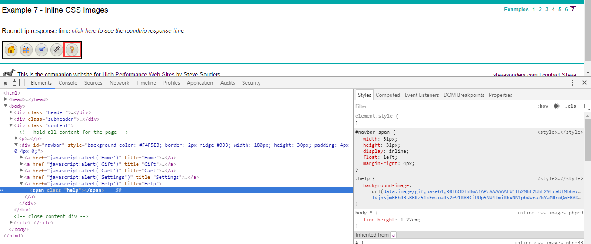
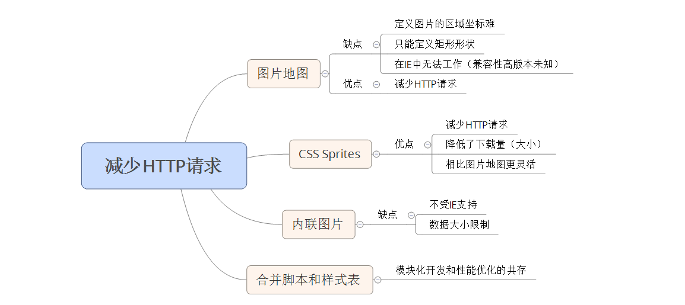

# 性能优化之一减少HTTP请求

**性能优化黄金法则**： 只有10%~20%的最终用户响应时间花在了下载HTML文档上，其余的80%~90%时间花在了下载页面中的所有组件上（脚本、CSS样式表、图片、Flash）。换我自己的化说，就是改动前端的收益大

关注前端可以很好的提高性能： 后端响应时间缩短一半，整体响应时间只能减少5%~10%。而如果关注前端性能，同样是将其响应时间减少一半，则整体响应时间减少40%~45%。

改进前端通常只需要较少的时间和资源： 减少后端延迟会带来很大的改动，例如：重新设计应用程序的架构和代码、查找和优化临界代码路径、添加或改动硬件、对数据库进行分布化等。

前端性能调整实践证明可行

## 图片地图

允许你在一个图片上关联多个URL，目标URL的选择取决于用户点击了图片上的哪个位置。
### 图片地图两种类型 
服务器端图片地图： 将所有点击提交到同一个目标URL，向其传递用户点击的x、y坐标。Web应用程序将该x、y坐标映射为适当的操作  
客户端图片地图： 它可以将用户的点击映射到一个操作，而无需向后端应用程序发送请求。映射通过HTML的MAP标签实现。
 
### 图片地图的缺点
* 在定义图片地图的区域坐标时，如果采取手工的方式则很难完成且容易出错
* 除了矩形之外几乎无法定义其他形状
* 通过DHTML创建的图片地图在Internet Exploer中无法工作

### 图片地图使用场景
若导航栏和超链接中使用多个图片，则使用图片地图是加速页面的最简单的方式

## CSS Sprites
又称为CSS 雪碧图，我用自己的话来总结什么是雪碧图吧，简单来说就是将在页面中需要用到的大量图片合并成一张图片，在一个图标或背景或导航或链接的class样式需要背景图片时，通过CSS样式background-position属性来定位偏移量来得到需要的图片。

### 优点
* 通过合并图片减少了HTTP请求，并且比图片地图更灵活
* 降低了下载量（合并后的图片比分离的图片小，因为降低了图片吱声的开销（颜色表、格式信息，等等））

## 内联图片
data: URL 允许将小块数据内联为‘立即数’，数据就在其URL自身之中，其格式如下：  
data: [< mediatype>][;base64],< data>   
例如：  

通过使用data: URL模式可以在Web页面中包含图片但无需任何额外的HTTP请求。

## 内联图片的缺点
* data: URL模式的主要缺陷在于不受IE得支持（直到版本7后续版本自己查吧）
* 可能存在数据大小上的限制
* 由于data: URL是内联在页面中，在跨越不同页面时不会被缓存  
	解决： 使用CSS并将内联图片作为背景，将该CSS规则放在外部样式表中，虽然增加了一个额外的HTTP请求，但被缓存后可以得到额外的收获。

## 合并脚本和样式表
模块化的原则是好，便于开发，但是每个文件都会导致一个单独HTTP请求，将这些文件合并到一个文件中，即可减少HTTP请求的数量并缩短最终用户响应时间。在理想的情况下，一个页面应该使用不多于一个的脚本和样式表。

### 模块化和性能优化的共存
 对于习惯了编写模块化代码的开发者来说，将所有东西合并到一个单独的文件中像是一种倒退，而将所有的Javascript合并为一个单独的文件在开发环境中很难(一个页面可能需要的脚本的组合很多)。  
**解决的方法:** 遵守编译型语言的模式，保持javascript的模块化，而在生成过程中从一组特定的模块生产一个目标文件。   
**难点:**合并脚本和样式表文件很容易，难得是组合的数量的增长，如果有大量需要不同模块的页面，组合的数量就会非常的大。所以多花一些时间去分析页面，确保组合的数量是可管理的。

## 最后再附上本人的丑作

