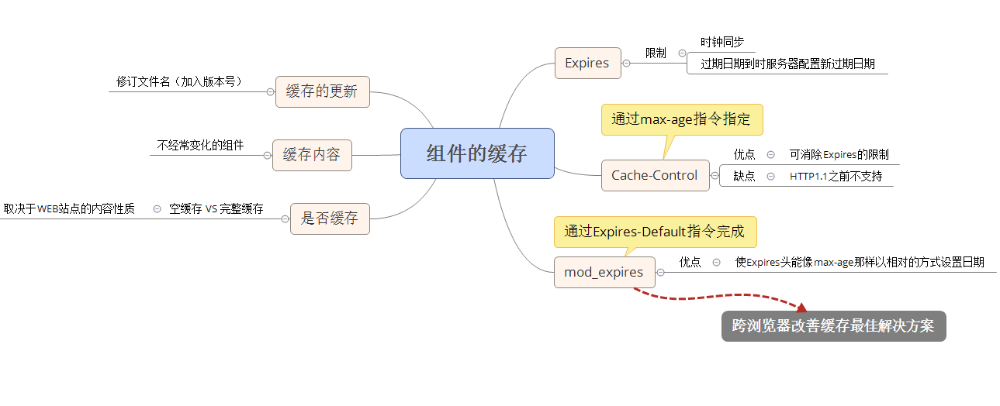

# 性能优化之三添加Expires头
页面往往包含了大量的组件（脚本、样式表、flash），通过expires头可以使这些组件被缓存,这在后续的页面浏览中避免不必要的HTTP请求。

## Expires头
Web服务器使用Expires头来告诉Web客户端它可以使用一个组件的当前副本，直到指定的时间为止。

	Expires: Fri, 30 Oct 2017 14:19:41 GMT

### Expires头的缺陷
* Expires头使用一个特定的时间，他要求服务器和客户端的时钟严格同步
* 过期日期需要经常检查，并且一旦未来这一天到来了，还需要在服务器配置中提供一个新的日期

## Max-Age 和mod_expires
### Max-Age
HTTP1.1引入了 Cache-Control 头来克服 Expires 头的限制，Cache-Control 使用 max-age 指令指定组件被缓存多久。

	Cache-Control: max-age=315360000

对于不支持HTTP1.1的浏览器可同时指定这两个响应头- Expires 和 Cache-Control max-age，若两者同时出现HTTP规范 max-age 指令重写 Expires 头。

### mod_expires
对于不支持HTTP1.1的浏览器，Expries 带来的时钟同步和配置维护问题可以使用 mod_expires Apache 模块，使你在使用Expires头时能够像 max-age 那样相对的方式设置日期。这通过 Expires-Default 指令来完成  
例如： 在下面的例子中，图片、脚本和样式表的过期时间被设计为自请求开始的10年之后，它同时向响应中发送Expires头和Cache-Control max-age头 

	<FilesMatch "\.(gif|jpg|js|css)$">
	ExpiresDefault "access plus 10 years"
	</FilesMatch>

跨浏览器改善缓存的**最佳解决方案**就是使用由 ExpiresDefault 设置的 Expires 头

## 空缓存 VS 完整缓存
只有在用户已经访问过你的网站之后，长久的 Expires 头才会对页面浏览产生影响，使你的组件可缓存能够改善这些用户的响应时间。  
空缓存或完整缓存页面浏览的数量取决于Web应用程序的本质。（例如：京东、天猫，商品的图片不可能相同空缓存较好，相比旅游网站或E-mail网站中可能每个用户会话能产生多次页面浏览，完整缓存较好）

## 不仅仅是图片
长久的 Expires 头应该包含任何不经常变化的组件，包括脚本、样式表和 Flash 组件，HTML 文档不应该使用长久的 Expires 头，因为它包含动态内容，这些内容在每次用户请求时都将更新。

## 修订文件名
为了确保用户能获取组件的最新版本，需要在所有HTML页面中修改组件的文件名。
实现方式： 将版本号嵌入在组件的文件名中，嵌入版本号不仅可以改变文件名，还能在调试时更容易找到准确的源代码文件

## 总结
使用 Expires 头能够避免额外的 HTTP 请求，可以减少一半的响应时间。  
相反的情况： 如果一个组件没有长久的 Expires 头，它仍然会存储在浏览器的缓存中。在后续请求中，浏览器会检查缓存并发现组件已经过期。为了提高效率，浏览器会向原始服务器发送一个 GET 请求，如果组件没有改变，原始服务器可以免于发送整个组件，而是发送一个很小的头， 告诉浏览器可以使用其缓存的组件。

## 大作

