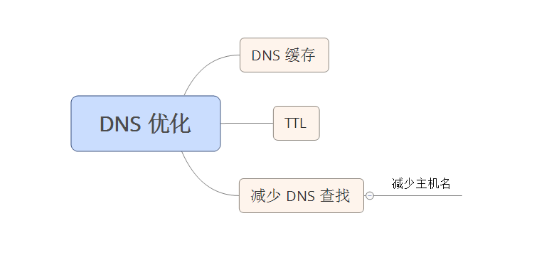

# 性能优化之久减少 DNS 查找
DNS 将主机名映射到 IP 地址上，当你在浏览器中输入 www.yahoo.com 时，连接到浏览器的 DNS 解析器会返回服务器的 IP 地址。  
DNS 优点： 可以将多个 IP 地址关联到一个主机名，为网站提高冗余度。  
DNS 缺点： DNS 解析需要花费时间，在 DNS 查找完成之前，浏览器不能从主机名那里下载任何东西。相应时间依赖于 DNS 解析器（通常由你的 ISP 提供）、它所承担的请求压力、你与他之间的距离和你的带宽速度。

## DNS 缓存和 TTL 
DNS 查找可以被缓存起来以提高性能。这种缓存发生在你的 ISP 或局域网中的一台特殊的缓存服务器上，同时 DNS 信息会留在用户操作系统的 DNS 缓存中。  
很多浏览器也拥有自己的缓存，和操作系统的缓存相分离，只要浏览器中保留了 DNS 记录，它就不会麻烦操作系统来请求这个记录。

### 什么是TTL？ 
TTL是 Time To Live的缩写，该字段指定IP包被路由器丢弃之前允许通过的最大网段数量。TTL是IPv4包头的一个8 bit字段。    
TTL的作用是限制IP数据包在计算机网络中的存在的时间。TTL的最大值是255，TTL的一个推荐值是64。  
TTL的主要作用是避免IP包在网络中的无限循环和收发，节省了网络资源，并能使IP包的发送者能收到告警消息。
### 什么是域名的TTL？
TTL(Time- To-Live)，简单的说它表示一条域名解析记录在DNS服务器上缓存时间

## 影响 DNS 缓存的因素
服务器可以表明记录可以被缓存多久，查找返回的 DNS 记录包含了一个存活时间（Time-to-live, TTL）值。该值告诉客户端可以对该记录缓存多久。  
影响 DNS 缓存存活多久的因素：

* 尽管操作系统缓存会考虑 TTL 值，但浏览器通常忽略该值，并设置它自己的时间限制。
* HTTP 协议中的 Keep-Alive 特性可以同时覆盖 TTL 和浏览器的时间限制（只要浏览器和 Web 服务器愉快的通信着，并保持着 TCP连接打开的状态，就没有理由进行 DNS 查找，避免了重复的 DNS 查找）
* 浏览器对缓存的 DNS 记录的数量也有限制，而不管缓存记录的时间。如果用户在短时间内访问了很多具有不同域名的网站，较早的 DNS 记录将被丢弃，必须重新查找该域名。

## TTL 值
### 增大TTL值，以节约域名解析时间
通常情况下域名解析记录是很少更改的。我们可以通过增大域名记录的TTL值让记录在各地DNS服务器中缓存的时间加长，这样在更长的时间段内，我们访问这个网站时，本地ISP的DNS服务器就不需要向域名的NS服务器发出解析请求，而直接从本地缓存中返回域名解析记录。
TTL值是以秒为单位的，通常的默认值都是3600，也就是默认缓存1小时。我们可以根据实际需要把TTL值扩大，例如要缓存一天就设置成86400。

### 减小TTL值，减少更换空间时的不可访问时间
更换域名空间时会对DNS记录进行修改，因为DNS记录缓存的问题，新的域名记录在有的地方可能生效了，但在有的地方可能等上一两天甚至更久才生效，只就导致有部分用户在一段时间内无法不可访问网站了。
为了尽可能的减小这个各地的解析时间差，合理的做法是：  
1.先查看域名当前的TTL值。  
2.修改TTL值为可设定的最小值，建议为60秒。  
3.等待一天，保证各地的DNS服务器缓存都过期并更新了记录。   
4.设置修改DNS解析到新的记录，这个时候各地的DNS就能以最快的速度更新到新的记录。            
5.确认各地的DNS已经更新完成后，再TTL值设置成常用的值(如: TTL=86400)。

注意: 客户端收到的 DNS 记录的平均 TTL 值只有最大 TTL 值的一半。

## 浏览器的视角
大量独立的变量决定了一个特定的浏览器在请求一个主机名时是否会进行远程 DNS 请求。

* 重新启动 windows 可以清空 DNS Client 服务缓存
* 重新启动浏览器会清空浏览器缓存，但不会清空 DNS Client 服务缓存

### IE 
IE 的 DNS 缓存由三个注册表设置控制。

### Firefox

## 减少 DNS 查找
当客户端的 DNS 缓存为空（浏览器和操作系统都是）时，DNS 查找的数量与 Web 页面中唯一主机名的数量相等。这包括页面 URL、图片、脚本文件、样式表、Flash对象的主机名。  
减少唯一主机名的数量就可以减少 DNS 查找的数量。  
减少唯一主机名的数量的这种方式的**缺点在于**： 会潜在的减少页面中并行下载的数量。避免 DNS 查找降低了相应时间，但减少并行下载可能会增加响应时间。

建议： 将这些组件分别放到至少2个，但不要超过4个主机名下。

## 总结

