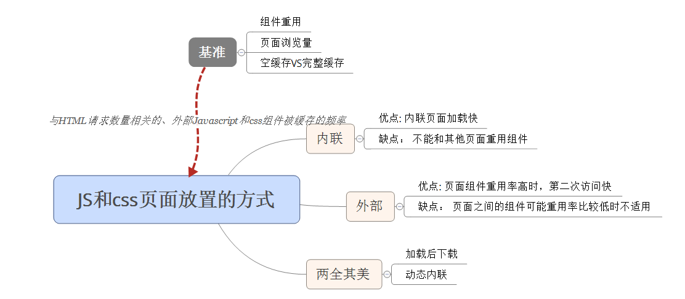

# 性能优化之八使用外部 JavaScript 和 CSS
## 内联 VS 外置

只有一个页面，内联时，减少了 HTTP 请求的数量，导致内联快一些。
但是当外部文件 javascript 和 CSS 文件有机会被缓存起来时，外部文件会快些。

**关键因素**： 与 HTML 文档请求数量相关的、外部 JAVAscript 和 CSS 组件被缓存的频率。这个因素难以量化，但可以通过下面的手段进行衡量。

#### 页面浏览量
每个用户产生的页面浏览量越少，内联 Javascript 和 CSS 的论据越强势。另一方面，如果用户产生的页面浏览量很多，则将外部文件放在缓存中，外部文件带来的收益随着页面浏览量的增多而增多。

#### 空缓存 VS 完整缓存
如果你的网站本质上能够为用户带来高完整缓存率，使用外部文件的收益就更大。如果不大可能产生完整缓存，则内联时更好的选择。

#### 组件重用
如果你的网站中的每个页面都使用了相同的 Javascript 和 CSS，使用外部文件可以提高这些组件的重用率。

在典型情况下，页面之间 Javascript 和 CSS 的重用既不可能 100% 重叠，也不可能 100% 无关。在这种中间情形中可分为两个极端：

* 为每个页面提供一组分离的外部文件  
* 创建一个单独的、联合了所有 Javascript 的文件，再创建一个包含了所有 CSS 的文件。

最好的方案： 折中，将页面划分为几种页面类型，然后为每种类型创建单独的脚本和样式表。如果可以找到一个平衡点，实现较高的重用度，则使用外部文件更好，反之使用内联。

## 典型的对比结果
对内联和使用外部文件进行对比分析时，关键点在于 HTML 文档请求数量相关的，外部 Javascript 和 CSS 组件被缓存的频率。可通过三种基准（页面浏览量、空缓存VS完整缓存和组件重用）来确定最好的选择。

## 主页
使用内联方式的一个例外就是主页。主页是选择作为浏览器默认也得 URL。从三个基准来看主页： 

* 页面浏览量： 主页每月有很高的页面浏览量数量。但通常每个会话只产生一个页面浏览量。
* 空缓存VS完整缓存： 出于安全的原因，很多用户选择在每次关闭浏览器时，清空缓存（不理解）
* 组件重用： 很多主页是用户来到网站后访问的唯一一个页面，谈不上重用

## 两全其美
要想既可以获得内联的优势，同时也能缓存外部文件，可参考下面的两种方法
### 加载后下载
对于主页，我们一般希望内联 Javascript 和 CSS，但又希望能为所有后续页面浏览量提供外部文件。可以通过在主页加载完成后动态下载外部组件来实现（通过 onload 事件）。这能够将外部文件放到浏览器的缓存中以便用户接下来访问其他页面。

### 动态内联
如果主页服务器知道一个组件是否在浏览器的缓存中，它可以在内联或使用外部文件之间做出最佳的选择。尽管服务器不能查看浏览器缓存中有些什么，但可以用cookies 做指示器。cookie 不存在，内联 js和css,存在则不内联（可能组件已缓存在浏览器中，并使用了外部文件）

## 总结
