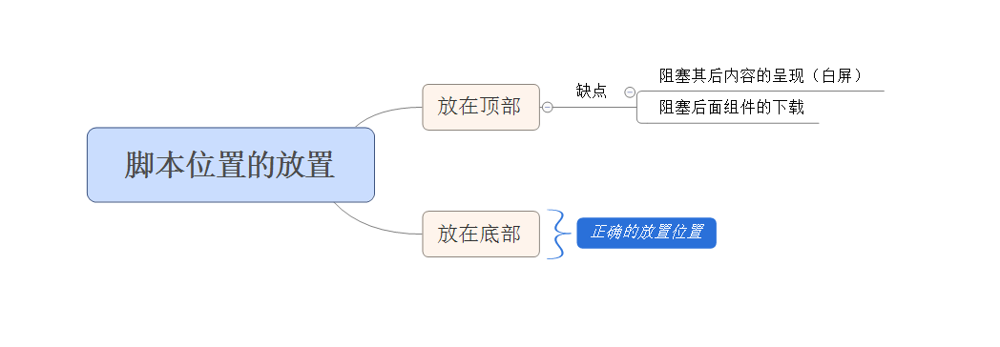

# 性能优化之六将脚本放在底部
## 脚本带来的问题
使用脚本时，对于所有位于脚本以下的内容，逐步呈现都被阻塞了。将脚本放在页面越靠下的地方，意味着越多的内容能够逐步地呈现。

## 并行下载
HTTP1.1 规范建议浏览器从每个主机名并行地下载两个组件。（可通过浏览器设置并行下载数量）
前端工程师与其依赖用户来修改浏览器设置，不如简单地使用 CNAME (DNS 别名) 来将组件分别放到多个主机名中。增加并行下载数量也是有开销的，其优劣取决于你的带宽和CPU速度，过多反而会降低性能。
>Yahoo! 的研究表明，使用两个主机名比使用 1、4 或 10 个主机名能带来更好的性能

## 脚本阻塞下载
在下载脚本时，并行下载实际上是被禁用的——即使使用了不同的主机名，浏览器也不会启动其他的下载。
原因如下：
 
* 脚本可能使用 document.write 来修改页面的内容，因此浏览器会等待，以确保页面能够恰当的布局
* 为了保证脚本能够按照正确的顺序执行

## 最差情况：将脚本放在顶部
脚本对 Web 页面的影响就清楚了：

* 脚本会阻塞对其后面内容的呈现（导致白屏）
* 脚本会阻塞对其后面组件的下载

## 最佳情况：将脚本放在底部
将脚本放置在底部，不会阻止页面内容的呈现，而且页面中的可视组件可以尽早下载

## 正确地放置脚本
正确的放置脚本

* 将脚本移到页面的底部
* 使用延迟 （Defferred）脚本。 Defferred 属性表明脚本不包含 document.write ,浏览器得到这一线索就可继续进行呈现。（在 Firefox 中，即便是延迟脚本也会阻塞呈现和并行下载），如果一个脚本可以延迟，那么它一定就可以移到页面的底部。

## 本节总结
