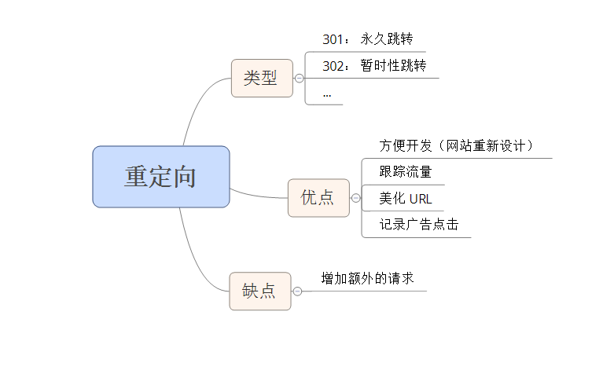

# 性能优化之十一避免重定向
重定向: 用于将用户从一个 URL 重新路由到另一个 URL。  
实现重定向有很多原因：

* 网站重新设计
* 跟踪流量
* 记录广告点击
* 建立易于记忆的 URL

重定向缺陷： 会使页面变慢

## 重定向类型
重定向有很多种，最常见的是：

* 301 Moved Permancently
* 302 Moved Temporarily (亦称 Found)

301 和 302 响应头中（Response Headers）会返回一个 Location 字段，留啦你去会自动将用户带到 Location 字段给出的 URL。重定向所必需的所有信息都出现在这个头中了。301 和 302 响应在实际中都不会被缓存，除非有附加的头—— 如 Expores 或 Cache-Control 等 ——要求它这么做。  

### 其他重定向方法 
HTML 文档的头中包含的 meta refresh 标签可以在其 contnet 属性所指定的秒数之后重定向用户。  

	<meta http-equiv="refresh" content="0; url=http://stevesouders.com/newuri">

Javascript 也可以用于执行重定向，将document.location 设置为期望的 URL 即可。  
注意： 如果你必须进行重定向，最好的技术是使用标准的 3xx HTTP 状态码，这主要是为了确保后退按钮能够正确工作。

## 重定向是如何损伤性能的
重定向带来额外的 HTTP 请求，用户等待响应时间变长。

## 重定向之外的其他选择
重定向是解决很多问题的简单方式，但最好使用其他不会减慢页面加载速度的解决方案。
### 缺少结尾的斜线
有一种重定向最为浪费，发生的也很频繁，但 Web 开发人员通常都没有意识到它。它发生在 URL 的结尾必须出现斜线 （/） 而没有出现时。  
当缺少结尾的斜线时发送重定向有着很充分的理由——它允许自动索引（autoindexing, 自动转到默认的 index.html上）并且能够获得与当前目录相关的 URL。  
解决方案： 可通过配置 apache mod_rewrite 模块与 Alias 指令来处理，apache 2.0中，可用 DirectorySlash 指令。  
注意： 当主机名后缺少结尾斜线时不会发生重定向。因为浏览器在进行 GET 请求时必需指定路径。如果没有路径，它会简单地使用文档根（/），也就是自动添加结尾斜线。  
参考： [配置apache之目录的索引](http://www.cnphp6.com/archives/60839)    
总结： 如果你的网站包含目录并使用了自动索引，用户就必须忍受一个到达预期页面的重定向。

### 连接网站
将用户从旧 URL 转移到新 URL 最简单的方式就是重定向。重定向是使用定义良好的 API —— URL 来整合两个代码库的一种方式。  
重定向的常见应用： 

* 将旧网站连接到新网站
* 将一个网站的不同部分连接起来
* 基于一些条件（浏览器类型、用户账户类型）来引导用户
* 使用重定向来连接两个网站很简单而且只需要很少的额外代码

重定向优点： 降低开发的复杂性，但也损害了用户体验。  
整合后端还有其他的选择，但比起简单的重定向需要更多的开发工作，不过这样非但不会损害用户体验，还能使之改善： 

* alias、 mod_rewrite 和 DirectorySlash 要求除 URL 之外还要提交到一个接口 (处理器或文件名)，但易于实现
* 如果两个后端位于同一台服务器上，则它们的代码很可能自己就能够连接。
* 如果域名变了，可以使用一个 CNAME(一条 DNS 记录，用于创建从一个域名指向另一个域名的别名)让两个主机名指向相同的服务器。如果能够做到这一点，这里提到的技术（alias、 mod_rewrite、 DirectorySlash 和直接连接代码）就是可行的。

### 跟踪内部流量
跟踪流量去向的两种方式： 

* 重定向（只需分析一个站点的 Web 服务器日志）
* 使用 Referer 日志来跟踪流量去向。每个 HTTP 请求都包含一个 URL，表明从哪个页面发起的请求，也就是引用方（必须分析所有的目标网站）

### 跟踪出站流量
当你尝试跟踪用户流量时，你会发现连接可能将用户带离你的网站（搜索引擎的搜索结果）。跟踪出站流量的两种方式： 

* 重定向（yahoo 通过将每个搜索结果链接包装到一个重定向中来解决跟踪的问题）  
  缺陷： 重定向使得获取目标页面变慢了，对用户体验有负面影响
* 信标： 一个 HTTP 请求，其 URL 中包含有跟踪信息。跟踪信息可以从信标 Web 服务器的访问日志中提取出来。信标通常是一个 1px X 1px 的透明图片。不过 204 响应更为优秀，因为它更小、从来不会被缓存，而且绝对不会改变浏览器的状态。
* 上述两种技巧都必须一个额外的 HTTP 请求。另一种方式是使用 XMLHttpRequest 来发送信标

### 美化 URL 
使用重定向的另一种动机是使 URL 更加美观并且易于记忆。  
关键是要找出一种方式，无需重定向就能拥有如此简洁的 URL。与其让用户忍受额外的 HTTP 请求，最好还是使用alias、 mod_rewrite、 DirectorySlash 和直接链接代码来避免重定向。

## 总结
