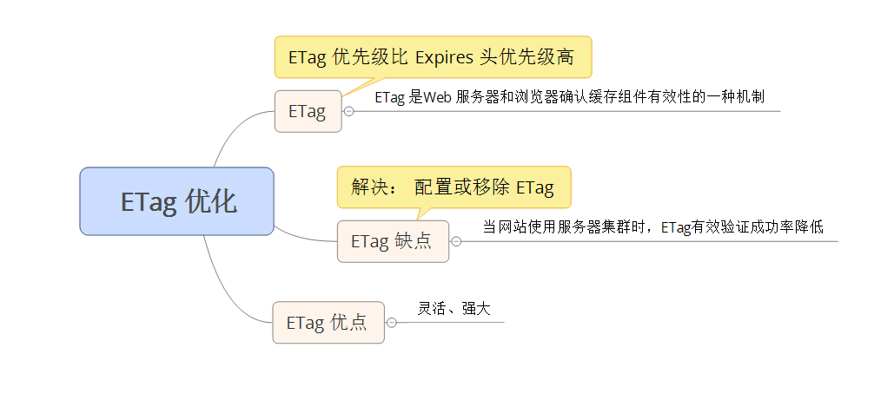

# 性能优化之十三配置 ETag
减少呈现页面时所必需的 HTTP 请求数量是加速用户体验的最佳方式。 可以通过最大化浏览器缓存组件的能力来实现这一目标，但当网站被宿主存在多于一台服务器上时， ETag 头可能会阻碍缓存。

## ETag 是什么？
实体标签是 Web 服务器和浏览器用于确认缓存组件有效性的一种机制。

### Expires 头
Web 服务器使用 Expires 头来告诉 Web 客户端它可以使用一个组件的当前副本，直到指定的时间为止。   
注意： Expires 头指定缓存是否有效，用的是时间标识的。

### 条件 GET 请求
如果缓存的组件过期了（或者用户明确地重新加载了页面），浏览器在重用它之前必须首先检查它是否仍然有效。  
服务器在检测缓存的组件是否和原始服务器上的组件匹配时有两种方式： 

* 比较最新修改日期
* 比较实体标签

### 最新修改日期
原始服务器通过 Last-Modified 响应头来返回组件的最新修改日期。  
第一次请求，浏览器缓存了组件以及他的最新修改日期（Last-Modified）。下一次请求，浏览器会使用 If-Modified-Since 头将最新修改日期传回到原始服务器进行比较，如果原始服务器上组件的最新修改日期与浏览器传回的值匹配，会返回以个304响应。

### 实体标签
ETag 提供除 Expires 头之外的一种检测浏览器缓存中的组件与原始服务器上的组件是否匹配的方式。  
ETag 是唯一标识了一个组件的一个特定版本的字符串。唯一的格式约束是该字符串必须用引号引起来。  
原始服务器使用 ETag 响应头来指定组件的 ETag。  
**注意**： ETag 头的优先级比 Expires 头的优先级高（我理解的是： 因为 ETag　标识的信息比　Expires头多）！！！意味着设置长时间的 Expires 头还是需要看 Etag 脸色行事的。

## ETag 带来的问题
ETag 的问题在于，通常使用组件的某些属性（大小、时间戳）来构造它，这些属性对于特定的、寄宿了网站的服务器来说是唯一的。但对于拥有多台服务器（服务器集群）的网站，Apache 和 IIS 向 ETag 中嵌入的数据都会大大地降低有效性验证的成功率（用户就不会受到 304 响应，相反会受到普通的 200 响应以及组件的所有数据）。  
原因： Apache 1.3 和 2.x 的 ETag 格式是 inode-size-timestamp; IIS 5.0 和 6.0 的 ETag 的格式是 Filetimestamp: ChangeNumber。  
文件系统使用 inode 来存储诸如文件类型、所有者、组合访问模式等信息。多台服务器之间的 inode 是不同的。 ChangeNumber 适用于跟踪 IIS 配置变化的计数器，对于多台 IIS 服务器来说， ChangeNumber 是不同的

## ETag ——用还是不用
如果在多台服务器上寄宿你的网站，而且使用的是默认 ETag 配置的 Apache 或 IIS，则会由于 ETag 不匹配带来的诸多问题（用户面对缓慢的页面、服务器负载高、消耗大量的带宽且代理也不能有效的缓存内容）， 就算你配置了长久的 Expires 头，还是无法避免条件 GET 请求， 因为我们的 ETag 是大佬，Expires头是小弟，如果 ETag 不匹配获得的是缓慢的 200 响应，匹配那么获得的就是 304。

解决方案： 

* 对 ETag 进行配置，以利用其灵活的验证能力（如果你的组件必须通过最新修改日期之外的一些东西来进行验证，则 ETag 是一种强大的方法）
* 如果无须自定义 ETag，最好简单地将其移除， Apache 和 IIS 都将 ETag 视为一个性能问题，并建议修改 ETag 的内容。

总结： 要么配置 ETag 要么移除 ETag

## 总结
