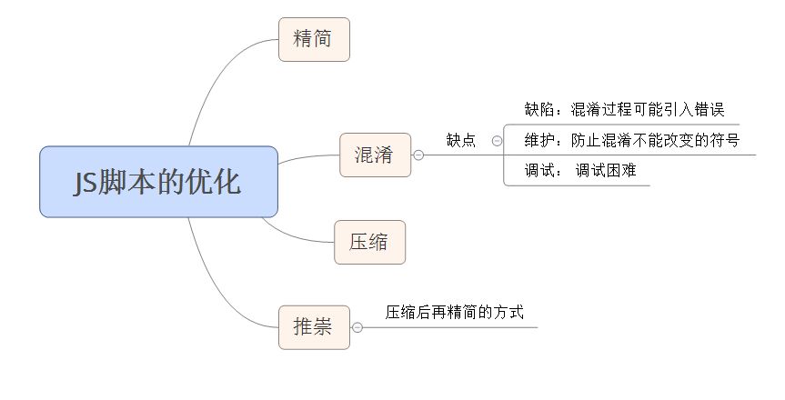

# 性能优化之十精简 Javascript
压缩文件可以减少文件大小，从而减少响应的时间。精简同样可以减少文件大小，但精简和压缩相比所带来的收益相比是有差距的。

## 精简
精简是从代码中移除不必要的字符以减小其大小，进而改善加载时间的实践。在代码被精简后，所有的注释以及不必要的空白字符（空格、换行和制表符）都将被移除。

## 混淆
混淆是可以应用在源代码上的另外一种优化方式。和精简一样，它也会移除注释和空白，同时它还会改写代码。（比如：函数和变量的名字将被转换为更短的字符串，通常这样做是为了增加对代码进行反向工程的难度，同时对提高性能也有帮助，因为这笔精简更能减小代码的大小）。

### 混淆缺点
* 缺陷：由于混淆更加复杂，混淆过程本身很有可能引入错误
* 维护：由于混淆会改变 Javascript 符号，因此需要对任何不能改变的符号（如 API 函数）进行标记，防止混淆其修改它们
* 调试： 混淆过的代码难以阅读，这使得在产品环境中调试问题更加困难

注： 精简和混淆相比，建议使用精简。

## 节省
在使用了 gzip 压缩之后，精简和混淆之间的差距将会减小。精简脚本可以降低响应时间，但不会带来混淆的风险。

## 内联脚本
内联的 Javascript 块也应该精简。 

## 压缩和精简
使用 gzip 来完成压缩，这通常可以使大小减小 70%。gzip 压缩比精简更能减小文件的大小。
混淆并压缩的效率和精简并压缩几乎一样，且精简可以避免混淆带来的额外风险。

## 精简CSS
精简 CSS 能够带来的节省通常要小于精简 Javascript，因为通常 CSS 中的注释和空白比 Javascript 少。  
最大的潜在节省来自于优化 CSS —— 合并相同的类、移除不适用的类等。CSS 依赖顺序的本质决定了这是一个复杂的问题。最佳的解决方案还是移除注释和空白，并进行一些直观的优化（比如使用缩写和移除不必要的字符串： '0' 代替 '0px'）;

## 总结
