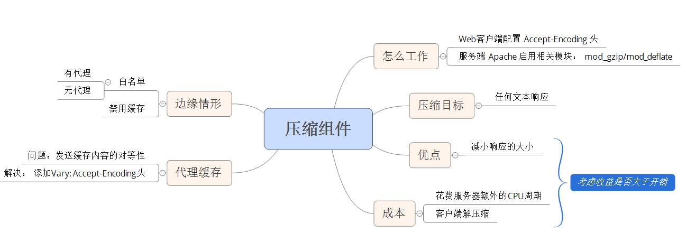

# 性能优化之四压缩
对 Web 服务器配置进行简单的修改，压缩尽可能多的组件，就能显著改善页面的反应速度
## 压缩是如何工作的
Web 客户端可以通过 HTTP 请求中的 Accept-Encoding 头来表示对压缩的支持；如果 Web 服务器看到这个请求中有这个头，就会使用客户端列出来的方法中的一种来压缩响应，Web服务器通过响应中的 Contenet-Encoding 头来通知 Web 客户端。  
gzip是目前最流行和最有效的压缩方法

## 压缩什么
### 压缩的内容
包括： XML 和 JSON 在内的任何文本响应！

### 压缩的成本
* 服务器端会花费额外的 CPU 周期来完成压缩
* 客户端要对压缩文件进行解压缩   

要检测收益是否大于开销需要考虑的点：  

* 响应的大小
* 连接的带宽和客户端与服务器之间的 Internet 距离  

根据经验： 通常对大于 1KB 或 2KB 的文件进行压缩

## 压缩带来的收益
压缩通常能将响应的数据量减少 70%

##　配置
配置 gzip 时使用的模块取决于 Apache 的版本

* Apache 1.3 使用 mod_gzip
* Apache 2.x 使用 mod_deflate

## 代理缓存

### 浏览器直接与服务器通信时
直接与服务器通信时所进行的配置都能很好的工作

### 浏览器通过代理来发送请求给服务器时
第一种情况：假设发送到代理的第一个请求是来自一个不支持 gzip 的浏览器，代理会将请求转发给服务器，服务器给代理未经压缩的响应，代理将此响应缓存并发送给浏览器。如果第二个请求访问的是同一个 URL ，来自一个支持 gzip 压缩的浏览器，则第二个请求获得的还是未经压缩的响应  
第二种情况： 第一个发送到代理的是支持 gzip 压缩的请求，代理从服务器获得经 gzip 压缩后的响应，响应被代理发送个浏览器并被缓存，第二个请求是不支持 gzip 压缩的浏览器，则它获得的是压缩后的响应，这就问题大了！

解决方案： 在 Web 服务器的响应中添加 Vary 头。 Web 服务器可以告诉代理根据一个或多个请求头来改变缓存的响应,这将使得代理缓存响应的多个版本。压缩的决定是基于 Accept-Encoding 请求头的，因此需要在服务器的 Vary 响应头中包含 Accept-Encoding 

	Vary: Accept-Encoding

## 边缘情形
* 发送压缩内容到不支持它的客户端、忘记将压缩内容声明为已经进行了gzip编码等，会导致页面都会被破坏。
* 在默认情况下，Etag 不能反映出内容是否被压缩，因此代理可能会向浏览器提供错误的内容   解决的办法： 禁用 Etag
>错误并不会经常发生，但他们是必须考虑的边缘情形      ---经典

### 浏览器白名单
一种安全的方式时只为已经证实过支持压缩的浏览器提供压缩内容。 这就是浏览器白名单，在其他的一些应用中也可以用白名单或黑名单的方式做处理！

如果加上代理的情形则更为复杂，和代理共享浏览器白名单的指令过于复杂，无法使用HTTP头进行编码。最佳做法是将 User-Agent 作为代理的另外一种评判标准添加到 Vary 头中(mod_gzip模块检测到在使用白名单时，会自动添加 User-Agent 到 Vary 头中)
                                                                                                                                                                                                                                                                                                                                                                                                                                                                                                                                                                                                                                                                                                                                                                                                                                                                                                                                                                                                                                                                                                                                                                                                                                                                                                                                                                                                                                                                                                                                                                                                                                                                                                                                                                                                                                                                                  
	Vary: Accept-Encoding,User-Agent

但是 User-Agent 头有上千种不同的值，代理不太可能为其所代理的所有 URL 缓存 Accept-Encoding 和 User-Agent 的全部组合。（甚至将会导致完全禁用为响应包进行的缓存 阔帕）

### 禁用代理缓存
使用 Vary: * 或 Cache-Control: Private来禁用代理缓存

* Vary: *  防止了浏览器使用缓存的组件
* Cache-Control: private 为所有浏览器禁用代理缓存（后果： 增加带宽开销）

### 平衡压缩和代理的支持
平衡压缩和代理的支持需要在加快响应时间、减小带宽开销和边缘情形浏览器缺陷之间进行权衡

* 如果你的网站用户很少，并且他们出于一个小圈子中，边缘情形浏览器就不需要太多关注，可以压缩内容并使用 Vary: Accept-Encoding
* 如果你更注意带宽开销，可以和前一种情况一样-压缩内容并使用 Vary-Encoding 
* 如果你拥有大量的、多遍的用户群，能够应付较高的带宽开销，并且享有高质量的名声，请压缩内容并使用 Cache-Crontrol: Private。 这禁用了代理缓存单避免了边缘情形的缺陷

## 大作

