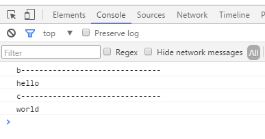

# JS 问题
工作中遇到的一些疑问

## $(document).ready() window.onload $(function() {}) 分别是什么？之间的异同？
预备知识： 客户端javascript 代码的执行

### 客户端 javascript 程序的执行
#### HTML 文档中嵌入 javascript 代码的四种方式
在 HTML 文档里嵌入客户端 javascript 代码有四种方法

* 内联，放置在 < script > 标签和 < /script> 标签对之间
* 放置在有 < script> 标签的 src 属性指定的外部文件中
* 放置在 HTML 事件处理程序中，该事件处理程序由 onclick 或 onmouseover 这样的 HTML 属性值指定
* 放在一个 URL 里，这个 URL 使用特殊的 "javascript:" 协议 

#### 客户端 javascript 代码的执行
javascript 程序的执行有两个阶段。

* 第一阶段，载入文档内容，并执行< script > 元素里的代码（包括内联脚本和外部脚本）。脚本通常会按照它们在文档里的出现顺序执行。所有脚本里的 javascript 代码都是从上往下，按照它在条件、循环以及其他控制语句中的出现顺序执行。
* 第二阶段，当文档载入完成，并且所有脚本执行完成后，javascript 执行就进入它的第二阶段。这个阶段是异步的，而且由事件驱动的（响应用户输入还可由网络活动、运行时间或 javascript 代码中的错误来触发）。

备注： 事件驱动阶段里发生的第一个事件是 load 事件，指示文档已经完全载入，并可以操作，通常定义一个onload 事件处理程序函数，这个函数会在脚本事件驱动阶段开始时被 load 事件触发。

#### 同步、异步和延迟脚本
javascript 第一次添加到 Web 浏览器时，还没有 API 可以用来遍历和操作文档的结构和内容。当文档还在载入时，Javascript 影响文档内容的唯一办法就是快速生成内容。它使用 document.write() 方法完成。  
脚本的执行只在默认情况下是同步和阻塞的。 < script > 标签可以有 defer 和 async 属性，在支持它们的浏览器中可以改变脚本的执行方式。defer 和 async 属性都像是在告诉浏览器链接进来的脚本不会使用 document.write(), 也不会生成文档内容，因此浏览器可以在下载脚本时继续解析和渲染文档 (客户端是单线程的)

* defer: 浏览器延迟脚本的执行，直到文档的载入和解析完成，并可以操作。
* async: 浏览器可以尽快地解析脚本，而不用在下载脚本时阻塞文档解析
注： async 和 defer 属性同时存在时，同时支持两者的浏览器会遵从 async 属性并忽略 defer 属性

### window.onload
>> window.onload 处理程序是最重要的事件处理程序之一。当显示在窗口中的文档内容稳定并可以操作时会触发它。javascript 代码通常封装在 onload 事件处理程序里 -引用自javascript 权威指南

#### 对 window.onload 的疑问？
如果有多个 < script > 标签包含多端 javascript 代码，那么最终执行的是哪一个 < script > 标签中包含的 window.onload 引用的事件处理程序？  
误解：

* 第二阶段的事件处理程序函数是等文档载入完成，并且所有脚本执行完成后，注意这个地方的所有脚本执行完成后，我误解的就是所有脚本执行完成后，然后执行window.onload 引用的事件处理程序函数；如果在一个页面中有多个 < script > 标签引入多个 js 文件， 那么按照从上到执行的顺序那么 window.onload 引用的事件处理程序函数，必然引用的是最后一个 < script > 标签定义的事件处理程序函数

正解： 

*  第一个 < script > 标签只要它自己下载完成并且执行完成后，它就会执行自己的 window.onload 引用的事件处理！意思就是说如果页面的结构是样式表，html代码在前，< script > 标签引入在后，那么每个 < script > 标签下载它自己完成后并执行它自己的代码，接着进入第二阶段，执行它定义的事件处理程序函数 （window.onload 引用的）

例： 

	<!DOCTYPE html>
	<html lang="zh-CN">
	<head>
	</head>
	<body>
		

		
		
	</body>
	</html>

浏览器控制台打印： 

### $(function() {}) 
$(function() {}) 是 $(document).ready() 的简写方式

### $(document).ready()
jquery 使用 $(document).ready() 方法来替代传统 javascript 的 window.onload 方法的。通过使用该方法，可以在 DOM 载入就绪时对其进行操作并调用执行它所绑定的函数。但是 $(document).ready() 方法和 window.onload 方法之间是有细微的区别的

### $(document).ready() 与 window.onload的区别
#### 执行时机
window.onload 方法是在网页中所有的元素（包括元素的所有关联文件）完全加载到浏览器后才执行，即 javascript 此时才可以完全访问网页中的任何元素  
$(document).ready() 方法注册的事件处理程序，在 DOM 完全就绪时就可以被调用。此时，网页的所有元素对 jquery 而言都是可以访问的，但是，这并不意味这这些元素关联的文件都已经下载完毕  

##### 解决使用$(document).ready() 注册内的事件元素的关联文件未下载完的问题
可以使用 jquery　中的另一个关于页面加载的方法 load() 方法，load() 方法会在元素的 onload 事件中绑定一个处理函数。如果处理函数绑定给 window 对象，则会在所有内容（包括窗口、框架、对象和图像）加载完毕后触发（感觉就是特么的window.onload 语义上都是一毛一样的），如果处理函数绑定在元素上，则会在元素的内容加载完毕后触发

#### 多次使用
在同一个js文件中多次的对window.onload 引用赋值，那么最后生效的肯定是最后一次赋值。但是$(document).ready() 方法每次都会在现有的行为上追加新的行为，这些行为函数会根据注册的顺序依次执行。
